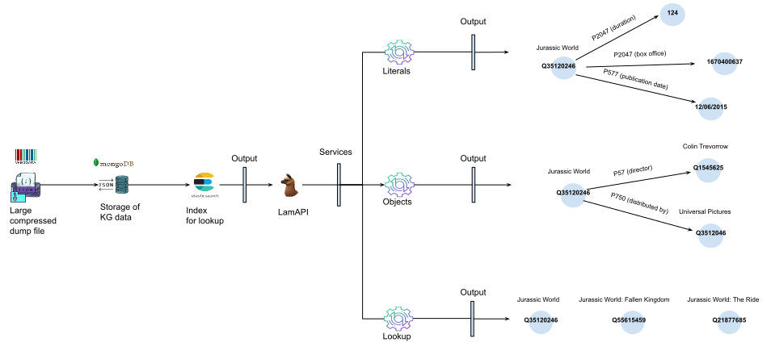

# LamAPI - Wikidata Label Matching API

## Introduction

LamAPI provides a user-friendly interface for streamlined access to Wikidata, offering Full-Text search capabilities and detailed entity analysis.

## Data Processing Pipeline

The following diagram illustrates the data processing pipeline used by LamAPI:



LamAPI processes data from Wikidata through the following stages:

1. **Data Ingestion**: The large compressed Wikidata dump file is ingested into the LamAPI ecosystem.
2. **Data Storage**: The ingested data is then decompressed and stored as JSON in MongoDB for structured and efficient data management.
3. **Data Indexing**: Using Elasticsearch, the stored data is indexed to enable rapid and precise Full-Text search capabilities.
4. **Service Interaction**: LamAPI exposes various services (lookup, objects, literals) that tap into the stored and indexed data to provide detailed information and analysis about entities within Wikidata.

## Core Services

LamAPI offers specialized services designed to cater to various data retrieval and analysis needs:

### Lookup Service

Conducts Full-Text searches across Wikidata to find entities matching input strings, providing quick access to a wealth of structured information.

- **Input**: Search string, e.g., "Jurassic World".
- **Output**: A list of entities related to the search term, including information like IDs and titles from Wikidata.

### Objects Service

Accesses relationships of Wikidata entities, allowing users to explore the connections and context of the data within the knowledge graph.

- **Input**: Entity ID, e.g., `Q35120246` for the film "Jurassic World".
- **Output**: Object data showing properties such as 'director' (P57) -> Colin Trevorrow (`Q1545625`), 'distributed by' (P750) -> Universal Pictures (`Q35120246`).

### Literals Service

Retrieves literal values associated with entities, such as labels, descriptions, and specific property values.

- **Input**: Entity ID, e.g., `Q35120246` for the film "Jurassic World".
- **Output**: Literal data like 'duration' (P2047) -> 124 (minutes), 'publication date' (P577) -> 12/06/2015, and 'box office' (P2041) -> 1670400637.


## Setup

This section provides a detailed guide on setting up LamAPI, including environment preparation, data acquisition, and system initialization.

### Prerequisites

Ensure you have the necessary permissions set on local volume folders. This can be achieved by running:

./setup-docker-volume.sh


### Starting the Services

Use `docker-compose` to initialize and run the LamAPI services:

    docker-compose up 

### Data Preparation

#### Data Acquisition

Download the data dump from ZENODO using the following link: [ZENODO Link](https://zenodo.org/record/10566718).

#### Data Placement

Move the downloaded dump to the `my-data` directory, which is mapped to the MongoDB container via a local volume.

#### Decompression

Unzip the data dump using the command:

    unzip FILE_NAME


#### Data Import
    docker exec -it lamapi_mongo bash -c 'cd /data/my-data && mongorestore --gzip --host=localhost --port=27017 --username="$MONGO_INITDB_ROOT_USERNAME" --password="$MONGO_INITDB_ROOT_PASSWORD" --authenticationDatabase=admin 
    --db=wikidata30062023 wikidata30062023'

    
    
### Elasticsearch Indexing

To create the Elasticsearch index, follow these steps:

1. Access the API container:
    ```
    docker exec -it lamapi_api bash
2. Navigate to the scripts directory:
    ```
    cd scripts
3. Run the elastic indexing script:
    ```
    python elastic_indexing.py <DATABASE NAME> <COLLECTION_NAME> <MAPPING_FILE>
Notes:
- Replace `<DATABASE NAME>` with the name of the MongoDB database where the Wikidata dump is stored.
- Replace `<COLLECTION_NAME>` with the name of the MongoDB collection containing the extracted Wikidata entities (items).
- Replace `<MAPPING_FILE>` with the path to the Elasticsearch mapping file (e.g., `index_confs/kg_schema.json`).
It is recommended to use `tmux` or a similar tool to manage terminal sessions, which can help in monitoring the progress of long-running commands.


### MongoDB Indexing

To create MongoDB indexes, follow these steps:
1.	Access the API container:
    ´´´
    docker exec -it lamapi_api bash

2.	Navigate to the scripts directory:
    ```
    cd scripts

3.	Run the Mongo indexing script:
    ```
    python build_mongo_indexes.py create_indexes <DATABASE_NAME>
Notes:
- Replace <DATABASE_NAME> with the target MongoDB database.
- You can also use:
    -   python build_mongo_indexes.py status to check MongoDB status.
    -   python build_mongo_indexes.py list_databases to list databases.
    -   python build_mongo_indexes.py list_collections <DATABASE_NAME> to list collections.
It is recommended to use tmux or a similar tool for long-running tasks.


### Final Steps

After completing the Elasticsearch indexing, LamAPI is fully set up. You can now start exploring its features and functionalities.

Please ensure to replace `FILE_NAME`, `<DIRECTORY THAT CONTAINS THE DUMP>` and `<DATABASE NAME>` with your actual project details.

## Environment Configuration

To ensure the seamless operation of LamAPI, it's essential to configure environment variables according to your deployment environment and requirements. An environment template is provided in the repository to guide you through this process.

### Using the Environment Template

1. **Locate the Template**: Find the `env.template` file in the repository. This file contains all the necessary environment variables that need to be configured for LamAPI and its dependent services.

2. **Customize Your Settings**: Copy the `env.template` file to a new file named `.env` in the root of your project. Fill in the values for each environment variable based on your specific setup. Comments in the template provide guidance on the expected values.

    - **Cluster Configuration**: Set up the cluster name, license type, and stack version.
    - **Elasticsearch Configuration**: Configure the Elasticsearch username, password, endpoint, and other related settings.
    - **Kibana Configuration**: Define the Kibana password and port number.
    - **MongoDB Configuration**: Provide MongoDB connection details including the endpoint, root username, and password.
    - **Other Configuration**: Adjust settings for threads, Python version, LamAPI token, supported knowledge graphs, and memory limits.

3. **Apply the Configuration**: Ensure that the `.env` file is read by your application upon startup. Most deployment environments and frameworks automatically detect and use `.env` files.

### Important Notes

- **Security**: Never commit the `.env` file or any file containing sensitive credentials to version control. Always keep your passwords and tokens secure.
- **Customization**: The provided values and settings are examples. You must customize them to fit your deployment and security requirements.
- **Documentation**: Refer to the specific documentation of each component (Elasticsearch, Kibana, MongoDB, etc.) for more detailed configuration instructions and best practices.

By following the environment template, you can tailor LamAPI's configuration to your project's needs, ensuring optimal performance and security.
